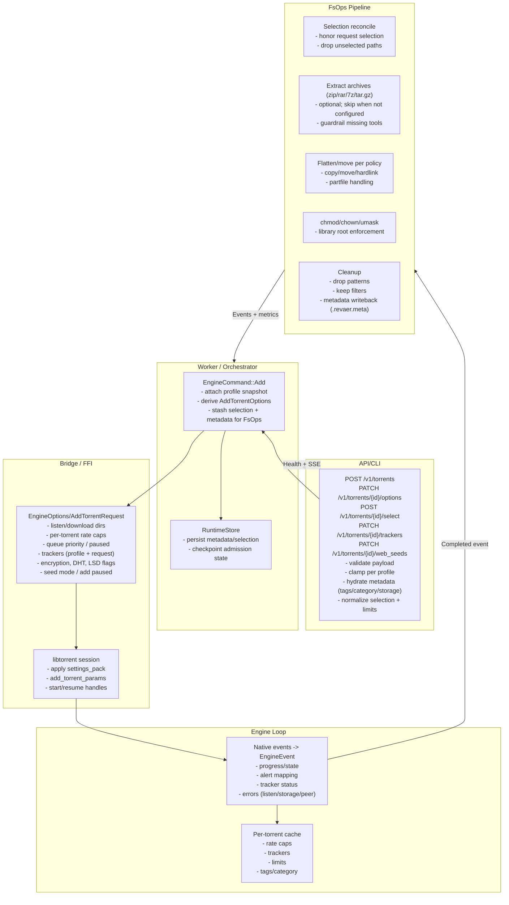
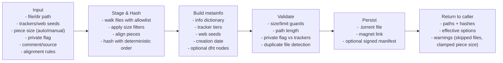

# Torrent Flows

Operational views for the torrent lifecycle and the torrent authoring path. These diagrams are reference-only; wire changes must follow the stored-procedure, clamp-before-apply, and observability guardrails in `AGENT.md`.

## Admission -> Runtime -> FsOps

### Notes

- Clamping and validation happen before persistence and before libtorrent sees the settings; unknown fields are ignored, unsafe values are clamped.
- Per-torrent limits (rate caps, queue priority, paused, seed mode) are applied immediately on admission and cached for later verification.
- FsOps runs on `Completed` with retries; every stage emits events/metrics and degrades health on guardrail breaches (tooling missing, permission errors, latency overruns).

## Torrent creation (authoring) flow

### Notes

- Creation respects the same glob filters and guardrails used by admission to avoid later FsOps surprises (exclude temporary/system files).
- When trackers or web seeds are provided, they remain deduplicated and ordered; private torrents skip DHT/PEX automatically.
- The flow is deterministic: file order, piece sizing, and hashing are reproducible given the same inputs and options.
- API endpoint: `POST /v1/torrents/create` (admin alias: `POST /admin/torrents/create`).
