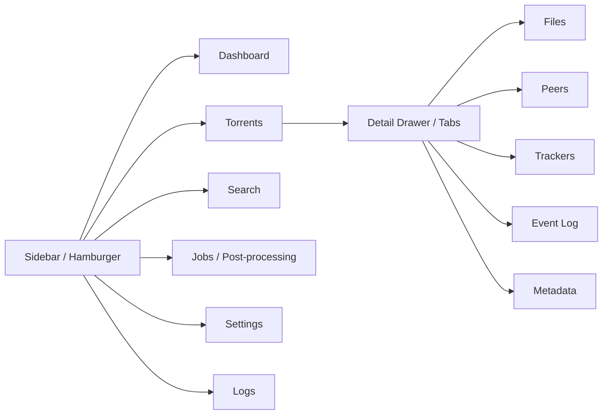
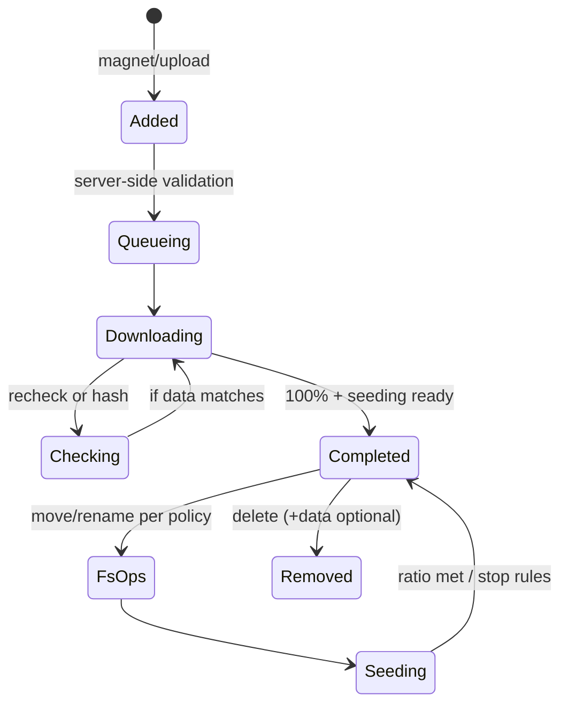

# Web UI Flows & Diagrams

Visual references for the Phase 1 UX: navigation, component wiring, SSE handling, and torrent lifecycle. Use these diagrams when extending the UI or adding tests.

## Navigation Flow



## Component Graph

```mermaid
flowchart TB
    App[App (RevaerApp)]
    Shell[AppShell (nav, mode/theme toggle, locale picker)]
    Dash[DashboardPanel]
    Table[TorrentView (virtualized list + filters)]
    Add[AddTorrentPanel]
    Detail[Detail Drawer/Tabs]

    App --> Shell
    Shell --> Dash
    Shell --> Table
    Table --> Add
    Table --> Detail
    Add -->|POST /v1/torrents| API
    Detail -->|PATCH /v1/torrents/{id}| API
```

## SSE Event Flow

```mermaid
sequenceDiagram
    participant API as API / SSE
    participant Stream as EventStream
    participant State as UI State (torrents, queue, jobs, vpn)
    participant UI as Components

    API-->>Stream: SSE events (torrent_progress, torrent_state, queue_status, jobs_update, vpn_state)
    Stream->>State: Batch apply with backoff + dedupe
    State-->>UI: Render updates (virtualized table, dashboard tiles, badges)
    UI-->>API: Last-Event-ID on reconnect; filters included in SSE query
```

## Torrent Lifecycle (UI Perspective)



## Interaction Notes

- SSE disconnect overlay shows last event timestamp, retry countdown (1s→30s exponential with jitter), and diagnostics (network mode, reason).
- Table virtualization is mandatory beyond 500 rows; virtual scroll must preserve keyboard focus order and pinned columns.
- Mobile detail view uses tabs (Files, Peers, Trackers, Log, Info); desktop uses split panes so file tree + metadata stay visible together at xl+.
