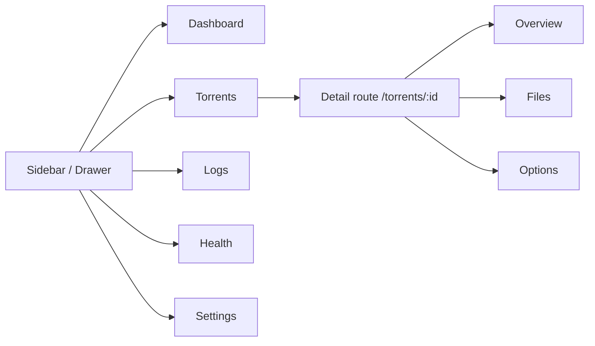
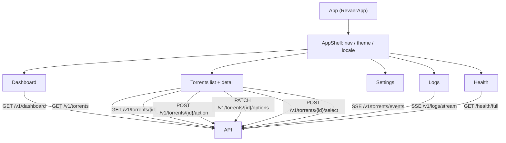
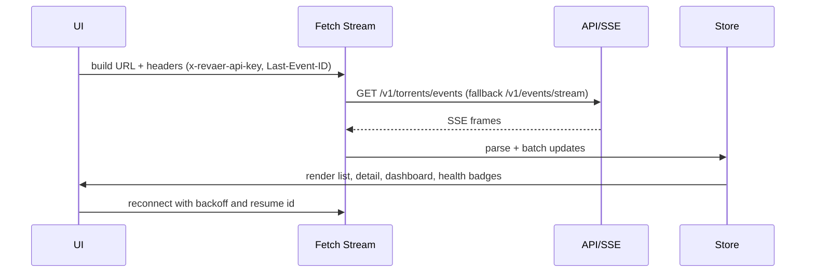
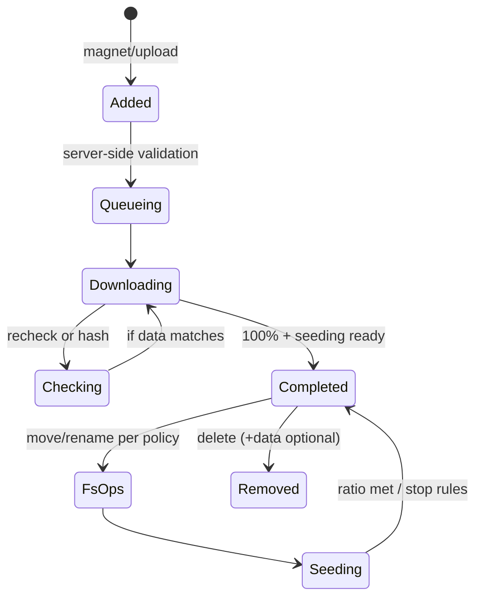

# Web UI Flows and Diagrams

Visual references for the Phase 1 UX: navigation, component wiring, SSE handling, and torrent lifecycle. Use these diagrams when extending the UI or adding tests.

## Navigation flow

## Component graph

## SSE event flow

## Torrent lifecycle (UI perspective)

## Interaction notes

- SSE disconnect overlay shows last event timestamp, retry countdown (1s to 30s exponential with jitter), and diagnostics (auth mode, reason).
- Table virtualization is required beyond 500 rows; virtual scroll must preserve keyboard focus order and pinned columns.
- Mobile detail view uses tabs (Overview, Files, Options); desktop uses a split layout so overview and options stay visible together at lg+.
