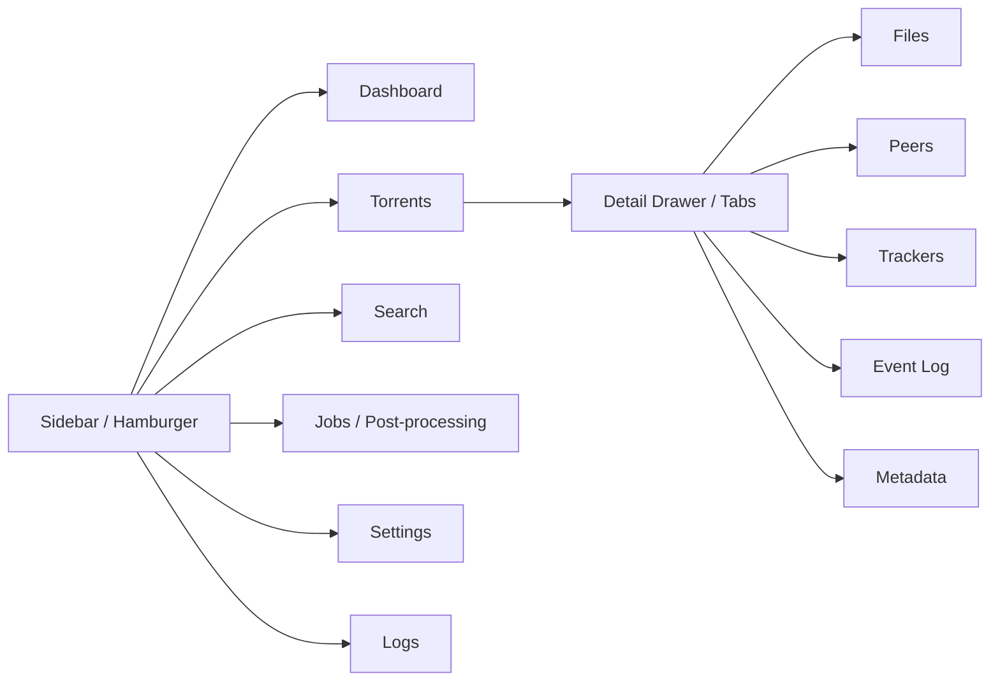
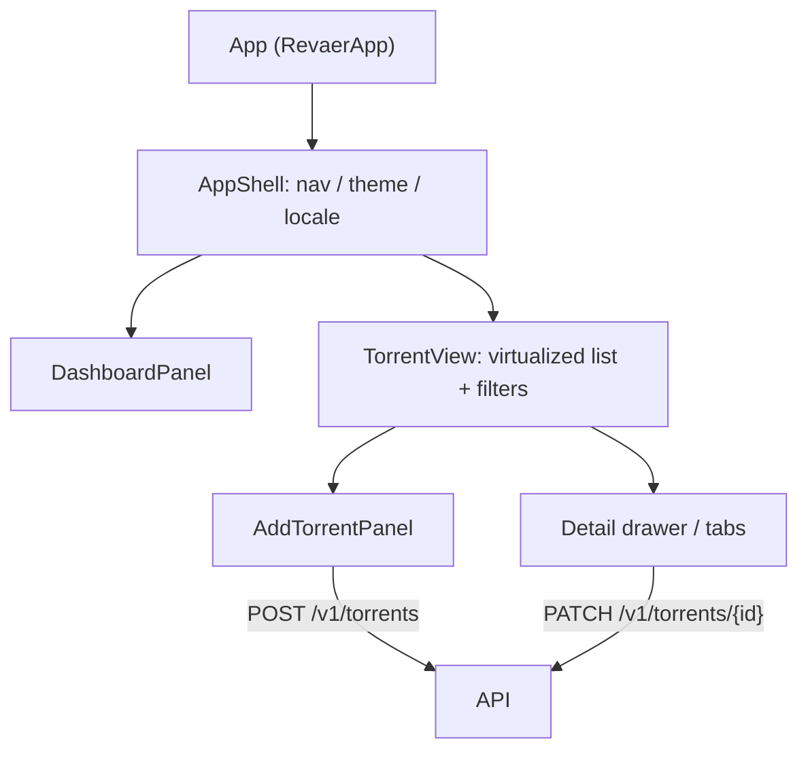
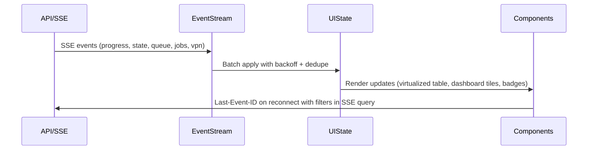
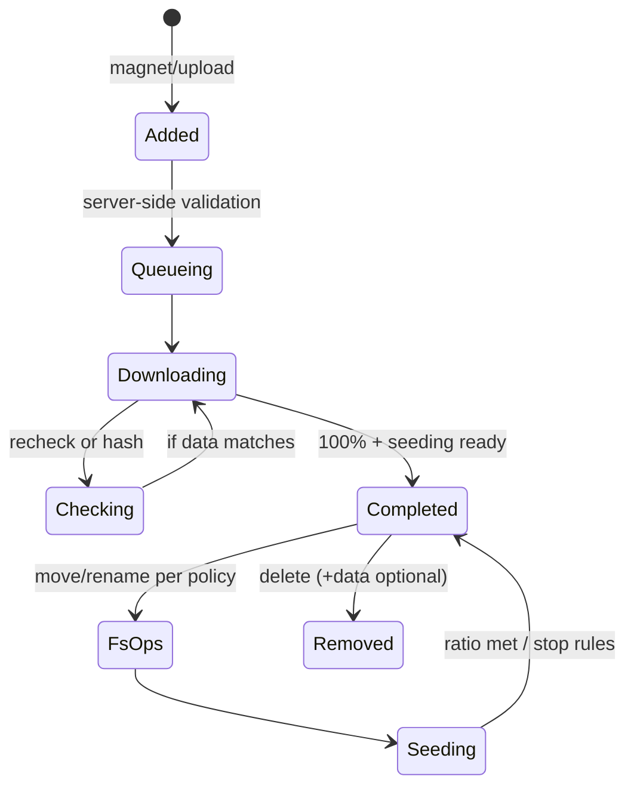

# Web UI Flows & Diagrams

Visual references for the Phase 1 UX: navigation, component wiring, SSE handling, and torrent lifecycle. Use these diagrams when extending the UI or adding tests.

## Navigation Flow

## Component Graph

## SSE Event Flow

## Torrent Lifecycle (UI Perspective)

## Interaction Notes

- SSE disconnect overlay shows last event timestamp, retry countdown (1s→30s exponential with jitter), and diagnostics (network mode, reason).
- Table virtualization is mandatory beyond 500 rows; virtual scroll must preserve keyboard focus order and pinned columns.
- Mobile detail view uses tabs (Files, Peers, Trackers, Log, Info); desktop uses split panes so file tree + metadata stay visible together at xl+.
